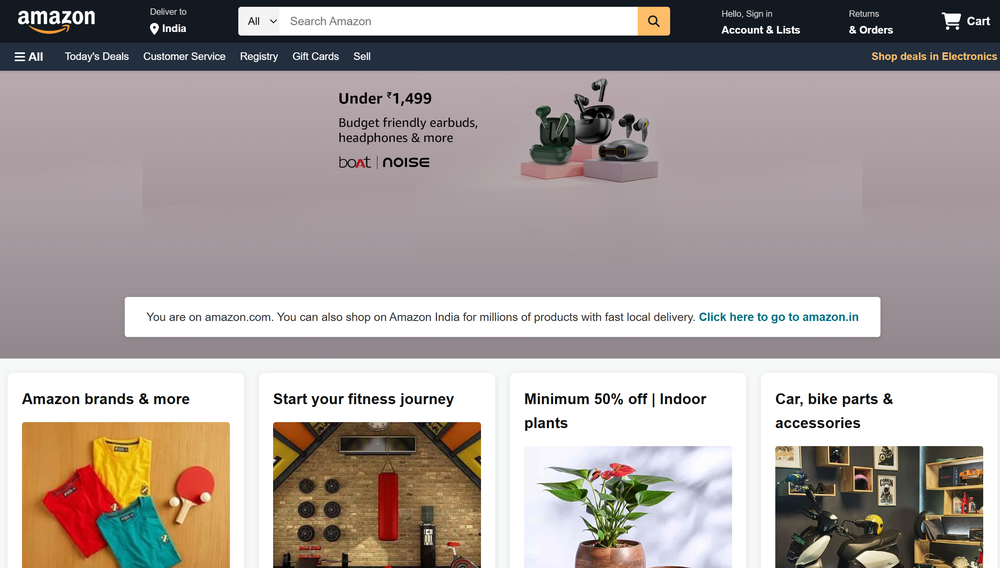
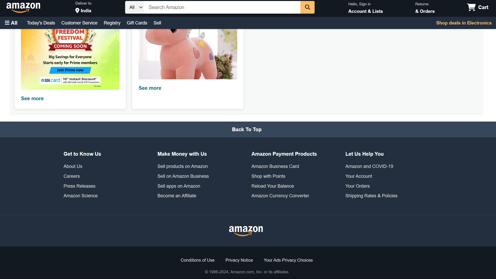
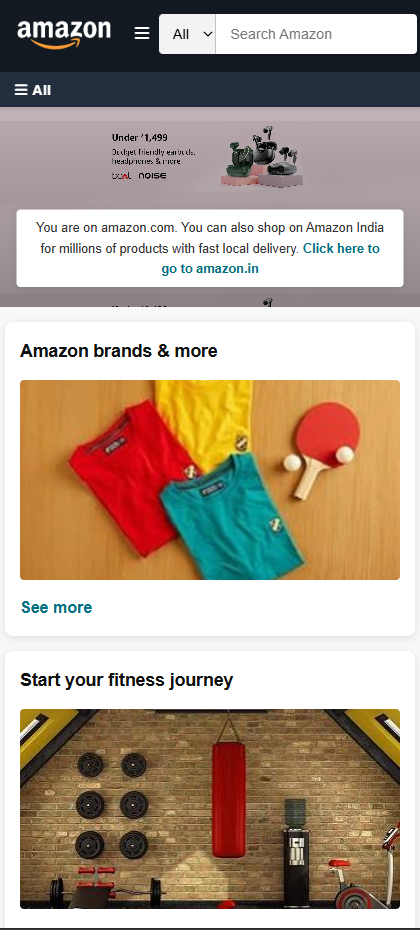
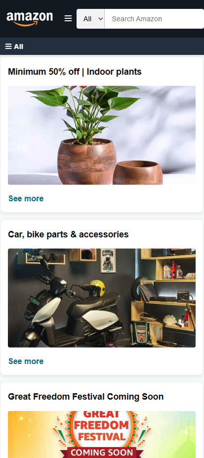
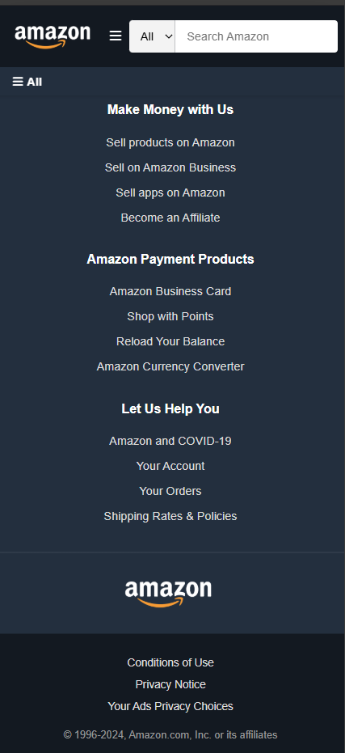

# 🛍️ Amazon UI Clone

[](LICENSE)
[](https://amazon-ui-clone-swart.vercel.app/)
[](https://developer.mozilla.org/en-US/docs/Web/HTML)
[](https://developer.mozilla.org/en-US/docs/Web/CSS)

---

## 📄 Description

**Amazon UI Clone** is a responsive front-end web page built using **HTML5** and **CSS3**, inspired by the official Amazon homepage.  
It replicates the look and layout of the real Amazon site, with a focus on responsive design and visual consistency.

> ⚠️ This is a UI-only clone for educational purposes and does not include real functionality such as login, cart, or checkout.

---

## 🔗 Live Preview

👉 **[View Project Live](https://amazon-ui-clone-swart.vercel.app/)**

---

## ✨ Features

- ✅ Fully responsive for all screen sizes  
- ✅ Clean and modern Amazon-like UI  
- ✅ Smooth transitions and hover animations  
- ✅ Mobile-friendly navigation bar  
- ✅ Font Awesome icons for header and footer  
- ✅ Organized layout with banners, sections, and product cards

---

## 🛠 Technologies Used

- HTML5  
- CSS3  
- Font Awesome Icons  

---

---






---

## ⚙️ Installation Instructions

Follow these steps to run the project locally:

1️⃣ **Clone the Repository**

```bash
git clone https://github.com/codewith-hardik/amazon-ui-clone.git
```

2️⃣ **Navigate to the Project Folder**

```bash
cd amazon-ui-clone
```

3️⃣ **Open in Browser**

You can simply double-click the index.html file or use a Live Server in VS Code.

✅ That's it — your clone will open in the browser!
